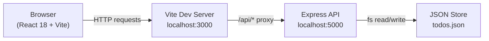

# todoapp — Full Stack Todo Application

A full-stack multi-page Todo app built with **React + Vite** (frontend) and **Node.js + Express** (backend), with file-based JSON persistence.

---

## Architecture



**Request flow:** React → Vite proxy → Express routes → JSON file → response

---

## Tech Stack

| Layer     | Technology                                      |
|-----------|-------------------------------------------------|
| Frontend  | React 18, React Router v6, Vite, @dnd-kit       |
| Backend   | Node.js, Express.js, dotenv                     |
| Storage   | JSON file (`backend/data/todos.json`)           |
| Styling   | CSS Modules, CSS variables, Google Fonts        |
| ID gen    | `uuid` v4                                       |

---

## Features

### Tasks
- ✅ Create, edit, delete todos
- 🔄 **Recurring tasks** — daily / weekly / monthly; auto-creates next occurrence on completion
- 🖱️ **Drag-and-drop reordering** — custom order persists to backend
- 📌 Pin tasks to keep them at the top
- ✓ Subtask checklists with progress bar
- 🏷️ Tags, categories, priority (high/medium/low), due dates, time estimates

### UX
- 🌙☀️ **Dark/Light theme toggle** — saved to localStorage
- ↩️ **Optimistic undo delete** — 5-second window to undo accidental deletes
- 🎉 **Confetti** when all active tasks are completed
- 💀 Shimmer skeleton loading cards
- 🛡️ React Error Boundary — prevents white-screen crashes
- ⌨️ Full keyboard shortcuts (N, /, G, 1-3, ?, Esc)

### Data
- 📊 Stats dashboard (completion rate, by-priority, by-category)
- 📥 **Export to JSON or CSV** via download button
- 🕐 Activity log (last 100 actions)

---

## Quick Start

### 1. Backend

```bash
cd backend
cp .env.example .env
npm install
npm run dev          # http://localhost:5000
```

### 2. Frontend

```bash
cd frontend
npm install
npm run dev          # http://localhost:3000
```

The Vite dev server proxies `/api/*` to `http://localhost:5000` automatically.

---

## Pages

### `/` — Todo List
Main page. Filter, search, sort, bulk actions, drag-to-reorder.

### `/todo?id=<uuid>` — Todo Detail
Single todo view — subtask management, notes, full metadata.

---

## API

Full request examples: [`docs/todoapp.postman_collection.json`](./docs/todoapp.postman_collection.json)

| Method | Endpoint                     | Description               |
|--------|------------------------------|---------------------------|
| GET    | `/api/todos`                 | List todos (filter/sort)  |
| POST   | `/api/todos`                 | Create todo               |
| PUT    | `/api/todos/:id`             | Full update               |
| PATCH  | `/api/todos/:id`             | Partial update            |
| DELETE | `/api/todos/:id`             | Delete todo               |
| DELETE | `/api/todos`                 | Bulk delete / clear done  |
| POST   | `/api/todos/reorder`         | Persist drag-drop order   |
| GET    | `/api/todos/export`          | Export as CSV or JSON     |
| GET    | `/api/todos/activity`        | Activity log              |
| GET    | `/api/stats`                 | Dashboard stats           |
| GET    | `/api/health`                | Health check              |

---

## Documentation

- [CHANGELOG.md](./CHANGELOG.md) — version history
- [CONTRIBUTING.md](./CONTRIBUTING.md) — setup guide, branch naming, commit style
- [Postman Collection](./docs/todoapp.postman_collection.json) — import to test every endpoint
