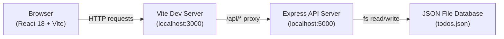

# Taska - Full Stack Task Management Application

Taska is a full-stack, single-workspace task manager built with React 18, Vite, Node.js, and Express. It persists tasks to a local, file-based JSON database, offering an efficient workflow for individual developers.

---

## 📁 Architecture Overview



Requests flow from the React front-end, through the Vite development proxy, to Express routes, which interact with the JSON database and return responses.

---

## 🔧 Tech Stack

* **Front-end:** React 18, React Router v6, Vite, `@dnd-kit/core`
* **Back-end:** Node.js, Express.js, `dotenv`
* **Storage:** Local JSON file database (`backend/data/todos.json`)
* **Styling:** CSS Modules, Vanilla CSS variables
* **Identifiers:** UUID v4

---

## • Features

### Task Management
* **List, Grid, and Board Views:** Toggle between clean list, multi-column grid, and Trello-like Board layouts directly on the tasks workspace.
* **Recurring Tasks:** Auto-generates the next task instance (daily, weekly, monthly) upon completing the current occurrence.
* **Board Drag-and-drop:** Move tasks across board columns (To Do, In Progress, Review, Completed) with automatic status updates.
* **Subtasks:** Managed checklists inside task details with progress tracking.
* **Task Pinning:** Keep high-priority items pinned at the top.
* **Search & Filters:** Search by title, description, category, or tags with priority and due date filtering.

### UX Details
* **Dark & Light Mode:** Theme toggle stored in `localStorage` for visual preference consistency.
* **Optimistic Updates:** Frontend registers completions immediately to guarantee responsiveness, falling back if the database update fails.
* **Keyboard Shortcuts:** Quick action bindings (`N` for new task, `/` for search, `Esc` to close).
* **Confetti:** Visual feedback trigger when all active tasks are completed.

---

## ⚙ Installation & Running Locally

### Prerequisites
* Node.js >= 18
* npm >= 9

### 1. Backend Server Setup
Navigate to the `backend` directory, install dependencies, and start the development server:
```bash
cd backend
cp .env.example .env
npm install
npm run dev
```
The backend server runs on `http://localhost:5000`.

### 2. Frontend Development Setup
Open a separate terminal window, navigate to the `frontend` directory, install dependencies, and launch Vite:
```bash
cd frontend
npm install
npm run dev
```
The client server launches on `http://localhost:3000` and automatically proxies `/api/*` requests to the backend server.

---

## 📖 API Endpoints

Full API request shapes are defined in [API.md](./docs/API.md) and the Postman collection located in [docs/todoapp.postman_collection.json](./docs/todoapp.postman_collection.json).

| Method | Endpoint | Description |
|--------|----------|-------------|
| GET | `/api/todos` | Fetch all tasks (supports search, sort, and status filtering) |
| POST | `/api/todos` | Create a new task |
| PUT | `/api/todos/:id` | Update all fields of an existing task |
| PATCH | `/api/todos/:id` | Partially update task fields (e.g. toggle completion) |
| DELETE | `/api/todos/:id` | Delete a single task |
| DELETE | `/api/todos` | Bulk delete tasks or clear completed ones |
| POST | `/api/todos/reorder` | Persist custom drag-and-drop sort order |
| GET | `/api/todos/export` | Export tasks as JSON or CSV |
| GET | `/api/todos/activity` | Retrieve the task activity log (last 100 entries) |
| GET | `/api/stats` | Retrieve workspace completion statistics |
| GET | `/api/health` | Backend status health check |

---

## 📁 Project Structure

```
todo-app/
├── backend/
│   ├── src/
│   │   ├── server.js          # Express initialization & SIGTERM handlers
│   │   ├── store.js           # JSON read/write file access layer
│   │   └── routes/
│   │       ├── todos.js       # Task CRUD, export, and order endpoints
│   │       └── stats.js       # Aggregation dashboard endpoint
│   ├── data/
│   │   └── todos.json         # JSON database storage
│   └── .env.example
├── frontend/
│   ├── src/
│   │   ├── components/        # Sidebar, modals, task cards
│   │   ├── pages/             # Dashboard, Tasks workspace, Settings, Details
│   │   ├── styles/            # Global variables, transitions, themes
│   │   ├── api.js             # API request layer
│   │   └── App.jsx            # Router and layout configuration
│   └── index.html
└── docs/
    ├── API.md                 # Detailed payload specification
    └── FEATURES.md            # App user guide
```

---

## ⚙ Design Decisions

* **Vite Proxying:** Handled proxy configurations inside `vite.config.js` to avoid CORS issues locally while keeping backend hostnames configurable.
* **JSON Store Persistence:** Used file-based JSON storage to eliminate external database installation requirements, keeping the project portable.
* **CSS Modules:** Used scoped class variables inside `*.module.css` files to prevent naming collisions.

---

## 🔧 Future Improvements

* **Unit Testing:** Implement Jest and React Testing Library configurations for frontend components.
* **Authentication:** Integrate session-based cookies or JWT authentication for multi-user setups.

---

## 📖 License

This project is licensed under the MIT License.
